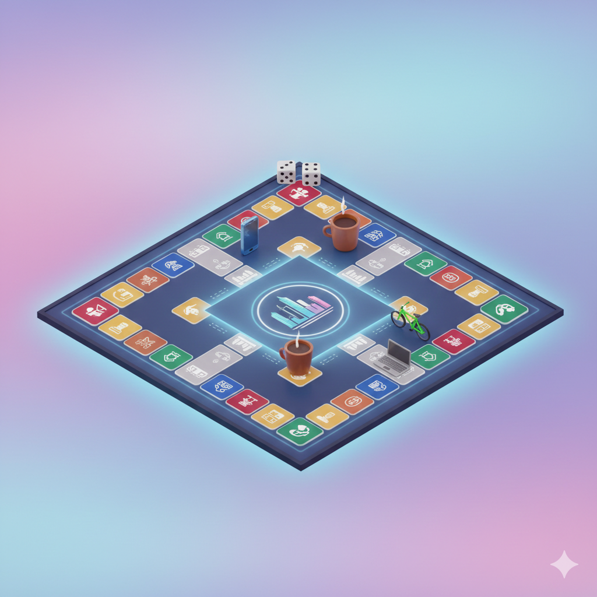
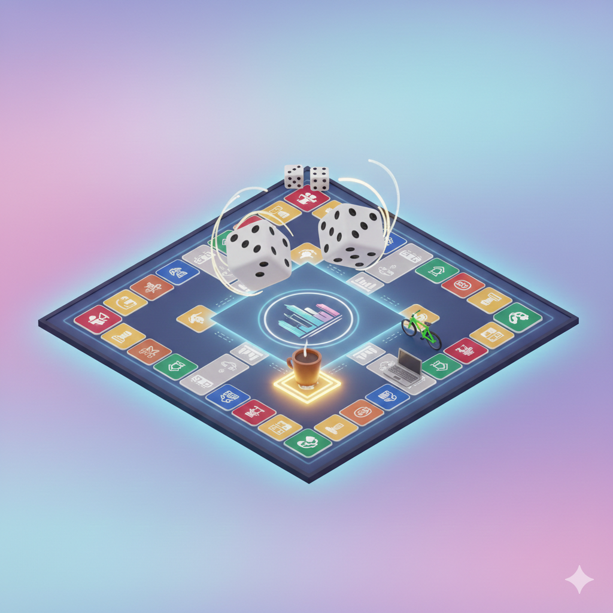
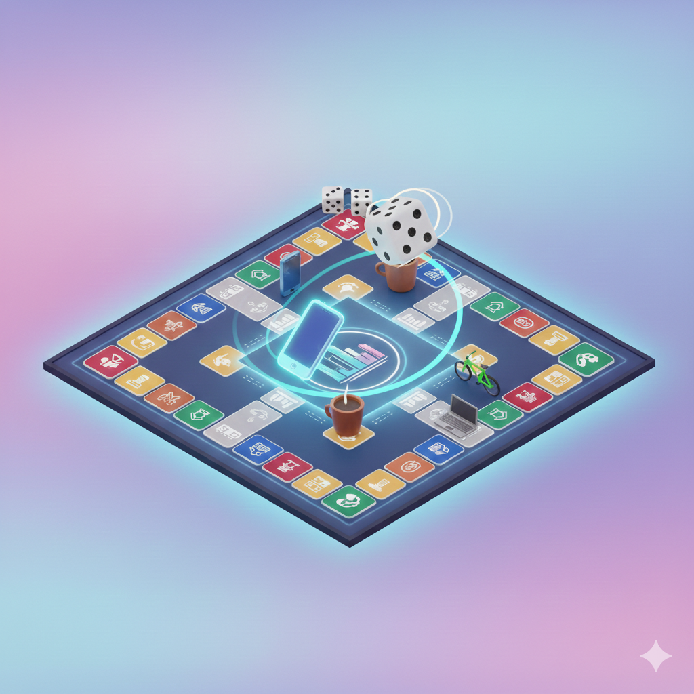
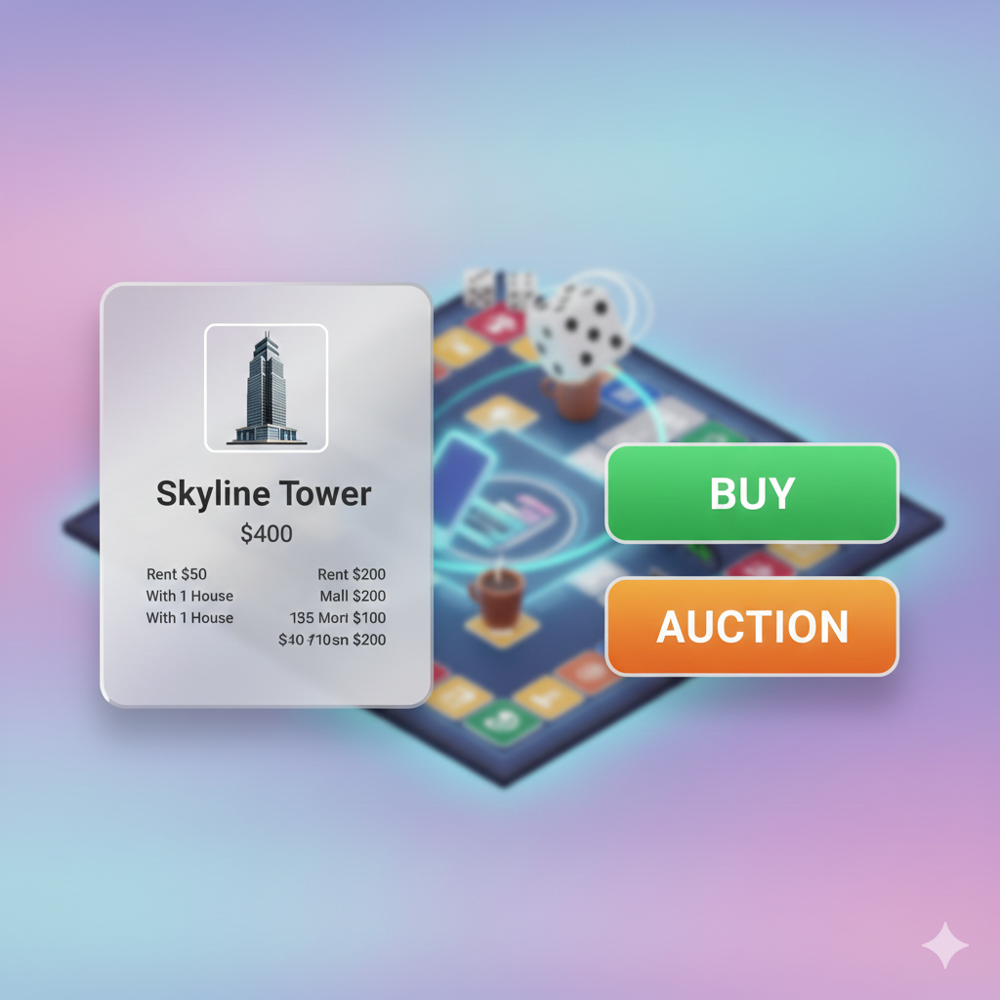
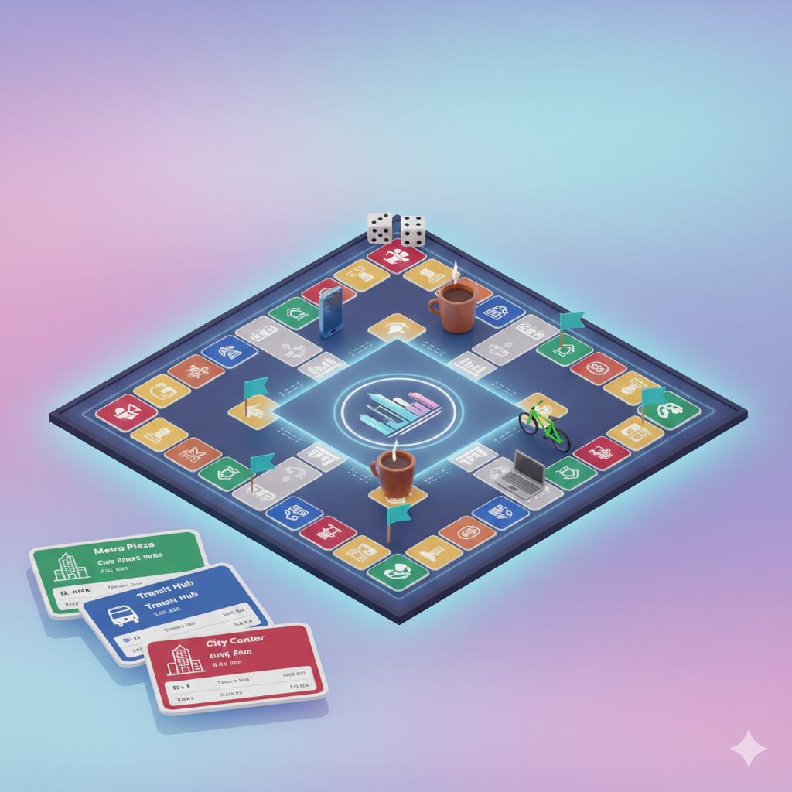
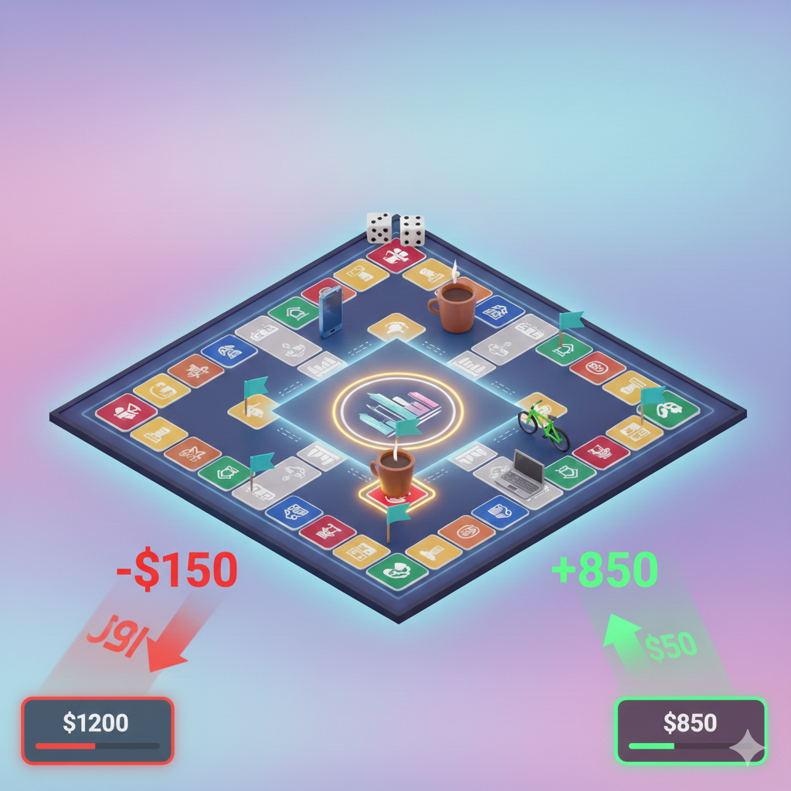
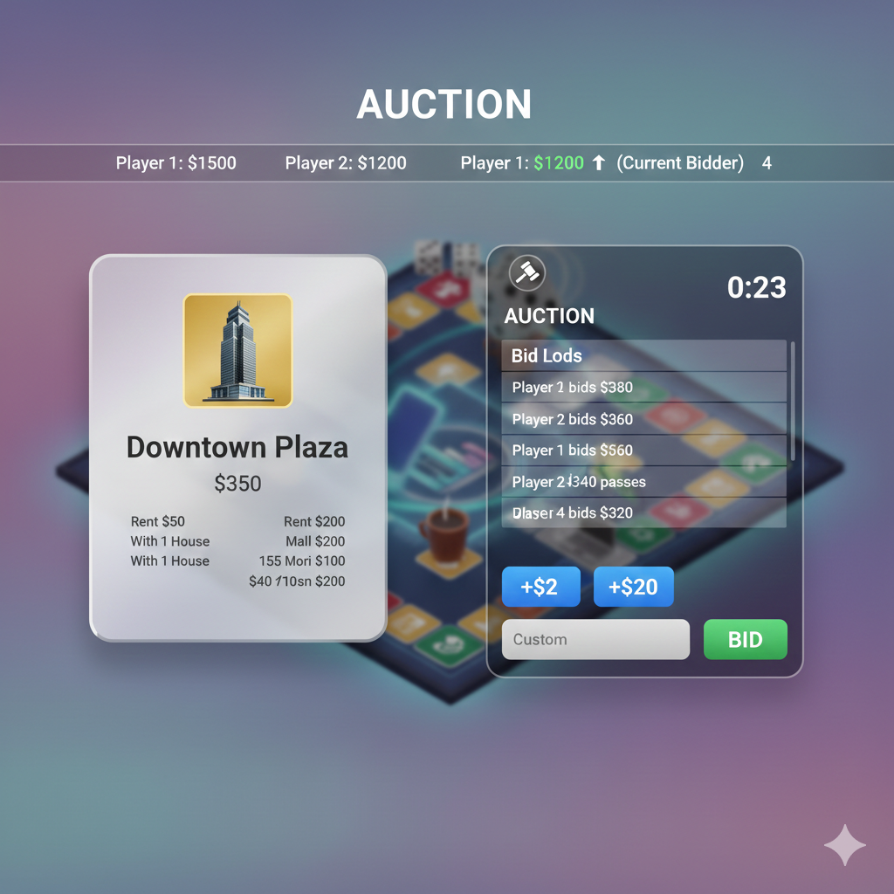
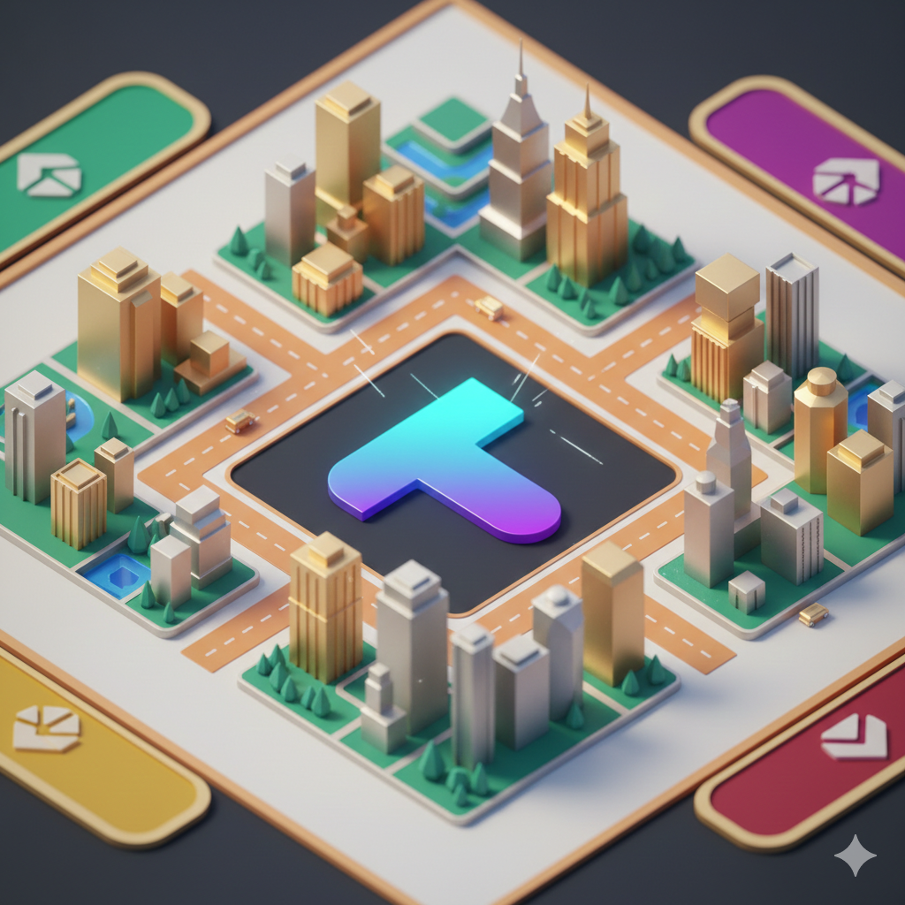

# DevLog #0 — Project Tycoon

> **Phase 0: Just Talks**  
> Status: Research, planning, and building confidence to start implementation

---

## Table of Contents

1. [The "Why" — Because That's What Matters](#the-why--because-thats-what-matters)
2. [The "What" — What Am I Building?](#the-what--what-am-i-building)
3. [Tech Stack — How I'm Building It](#tech-stack--how-im-building-it)
4. [Development Philosophy — My Approach](#development-philosophy--my-approach)
5. [The Phases — No Timelines, Just Progress](#the-phases--no-timelines-just-progress)
6. [The Vision — Look and Feel](#the-vision--look-and-feel)
   - [Overall Packaging](#how-will-the-overall-packaging-look-like)
   - [Gameplay Flow](#how-will-it-feel-when-starting-and-playing-a-chance)
   - [The Board Design](#the-board)
   - [The Auction System](#the-auction)
7. [The Legalities — Can I Even Do This?](#the-legalities--can-i-even-do-this)
8. [Visual Mockups — Bringing the Vision to Life](#visual-mockups--bringing-the-vision-to-life)
9. [What's Next](#whats-next)

---

## The "Why" — Because That's What Matters

### aiming isn't bad? right?

This is something that is overambitious for me and something that I want to build, but I'm not sure if I can pull it off. I am building this to learn, understand, and grow as a full-stack developer.

I was just too exhausted from building the same dashboards, landing pages, etc. and I just wanted to build something that **I** can use, which is fun.

### but why only this?

Recently, while deploying one of my projects, I was trying to find a quick game of monopoly, as I really like it, but I was not really able to find one which excites me enough to follow and play through it. Most of them were either just plain boring or just simulations of the game, which are not fun to play, because... something that is not built natively for the web just won't perform natively.

### you know, there are other games like this, right?

Absolutely, I mean... who will know better than me, who's been thinking about this for a while?

Well yeah, I am certainly aware of whatever I am falling into and how many players (renditions) are out there, but I feel that I can do much better with the passion I have for this type of game. If I list some of them that are on the web after searching "monopoly play online" on Google, they are:

- [Richup.io](https://richup.io/)
- Monopoly rip-offs on [Miniplay](https://www.miniplay.com/)
- [Online Rento](https://boardgamesonline.net/Online/monopoli)
- [PolyBusiness](https://www.crazygames.com/game/polybusiness) ← This one is... kinda fun, but slow.
- [Webopoly](https://www.webopoly.org/)

> Only these were in the first page of results, I am sure there should be many more.

I have almost 2-3 editions of Monopoly lying around and an Indian rip-off of the game (which I bought after playing the role of a stubborn child, but okay that's another story hahaha).

What I want to build is something that is **premium**, **beautiful** and **fun** to play. Something that will be **better** than its peers, in terms of gameplay, engagement, and overall experience.. because I am making this out of my own deliberate yet nuanced interest in the game.

### so, you already knew the competition, then why build this?

First, my interest.

And second, I reached out to [r/boardgames](https://www.reddit.com/r/boardgames/) and pitched the idea of building a web-based 3D board game like Monopoly. And I was kinda surprised to see the response, which was certainly, not what I expected.

Most of the comments were complaining about:

- Non-availability of turn clock and speed settings (standard/blitz modes like chess)
- Easy auction and trading system without voice chat
- Toggleable house rules (free parking money, no auction mode, various jail rules)
- Existing games being too luck-dependent and lacking skill-based mechanics.

Then I started the research about the same, here I am, writing my first devlog :)

---

## The "What" — What Am I Building?

### so what am I building?

- MVP:
  - Web-based 3D board game like Monopoly.
  - The visual notch-up
  - Smooth animations
  - Consistent 60fps performance
  - Player vs AI
  - Good classic design with original artwork and tokens

- Later:
  - Multiplayer
  - Chat
  - Monetization

---

## Tech Stack — How I'm Building It

### what technologies am I using?

- Web technologies:
  - Frontend: Next.js with TailwindCSS and Shadcn UI — For the UI and other pages.
  - Backend: Node.js/Express.js — For consistent backend logic.
  - Database: Supabase — For auth (with Google OAuth) and data storage.

- Game Visual tech:
  - **[Three.js](https://threejs.org/) with [React Three Fiber (R3F)](https://r3f.docs.pmnd.rs/getting-started/introduction)**: this shall be used as the core rendering engine required to draw meshes, materials and lights.
  - **[Drei Helper Library](https://github.com/pmndrs/drei)**: the repo provides a good collection of components for R3F, which will be used to create the UI and other components.
  - **[GSAP](https://gsap.com/)**: after the [Lando Norris](https://landonorris.com/) website, this has kinda become the de-facto standard for animations in web-based animations. I know, I know, there's [Framer Motion](https://motion.dev/) and [Popmotion](https://popmotion.io/), but I just find this to be the most performant and feature-rich library for animations.
  - **[Post-processing](https://github.com/pmndrs/react-postprocessing)**: features like bloom, glowing tiles (will cover later in board design) or ambient occlusion for depth can be achieved through this library, which integrates seamlessly with the R3F pipeline.
  - **[Rapier.js](https://rapier.rs/)**: this is a physics engine that will be used to simulate the physics of the game, such as dice rolling, etc.

- Multiplayer and backend:
  - **[Colyseus](https://colyseus.io/)**: a framework based on Node.js, which is used to create the authoritative server for the game. It allows the server to maintain the "source of truth" while clients simply render the updates.
  - **[Socket.io](https://socket.io/)**: as we already know, this is used to create the real-time connection between the client and the server, which shall be used for auxiliary features like global chat systems or lobby notifications.
  - **[Supabase](https://supabase.com/)**: I have been using this for a while now, and for this project, it is okay with my level of understanding, as it is really good for managing non-real-time data such as basic auth/Google OAuth, player profiles, etc. The free tier is also good enough for this project, at least for now.

- AI and Game Logic:
  - **[Monte Carlo Tree Search (MCTS)](https://en.wikipedia.org/wiki/Monte_Carlo_tree_search)**: this is a searching algorithm that uses search trees based on random sampling to find the best move for the AI player.

| Category         | Primary Technology | Secondary/Alternative | Purpose                             |
| :--------------- | :----------------- | :-------------------- | :---------------------------------- |
| **3D Rendering** | React-Three-Fiber  | Vanilla Three.js      | Declarative 3D scene management     |
| **Animation**    | GSAP               | React Spring          | Smooth interpolation of movement    |
| **Multiplayer**  | Colyseus           | Socket.io             | Authoritative state synchronization |
| **Backend/Auth** | Supabase           | Firebase              | User data and Google OAuth          |
| **AI Algorithm** | MCTS (Heuristic)   | Minimax               | Decision-making for non-player bots |
| **Physics**      | Rapier.js          | Cannon.js             | Deterministic dice and collisions   |
| **Asset Format** | GLB (Draco)        | GLTF                  | High-performance 3D model delivery  |

---

## The Phases — The decision of no timelines

I am going to make this using **Phased-Approach**. With no prior timeline or anything, because I don't know how long it will take me to make this game.

So here are the phases that I have settled onto:

### Phase 0: Just talks

**Goal** - To become confident enough to start the implementation.

- Write **DevLog\_#0.md**
- Dive into the legalities of making a property-trading game, such that my assets do not collide with any existing IP.
- Go through the tech stack, gauge their viability/limitations, and look for any possible alternatives, if needed.
- Learning the core mechanics of the game, and how to implement them.

### Phase 1: CLI-head would love this

**Goal** - To implement core mechanics and have a CLI-ready game.

- Write game engine in pure JavaScript.
- Core mechanics:
  - Turn-based gameplay (who goes when)
  - Dice rolling logic (random number generation for two dices)
  - Token movement (moving the token based on the dice roll)
  - Property ownership and rent calculation
  - Bankruptcy and win conditions
  - Basic auction system
- Command-line interface (CLI): Type commands like "roll", "buy", "auction", "pass", "show board", "show balance".
- 2-4 players can play on the same computer, taking turns.

### Phase 2: "_I can see it now_ 🤩"

**Goal** - To implement a 2D React layer with visible buttons, icons, and a board, more like Richup.io.

- React frontend with basic components:
  - 2D board (flat grid, no fancy graphics)
  - Player stats panel (balance, properties owned)
  - Action buttons (Roll Dice, Buy, Auction, Pass)
  - Property cards display
  - Dice result display
  - Free icons for tokens
- State management (Zustand) to sync UI with game state.
- Guest mode: Play without logging in (no save, no persistence)

### Phase 3: Why not just... give it a polish?

**Goal** - Make the 2D version feel **premium** before touching 3D.

- Smooth animations and transitions
  - Dice rolling animation
  - Token movement between tiles
  - Money transactions (balance updates with visual feedback)
  - Property card reveals
- Sound effects:
  - Dice rolling sound
  - Token movement sound
  - Money transaction sound
  - Property purchase sound
- Responsive design: Works on desktop, tablet, and mobile
- Loading screen with dynamic text

### Phase 4: The opponent is here! AI. Obviously.

**Goal** - To implement MCTS (Monte Carlo Tree Search) for (dumb yet smart) AI opponents.

- MCTS algorithm implementation
- AI decision making for:
  - Buying properties
  - Bidding in auctions
  - Mortgaging properties
  - Trading properties
  - Building houses and hotels
- AI difficulty levels:
  - Easy (random moves)
  - Medium (basic strategy)
  - Hard (MCTS with optimizations)

> After this phase, this should be good for shipping it and getting some feedback from the users. Maybe this is **Alpha** stage.

### Phase 5: "_Wanna have a game? Chat?_"

**Goal** - To add multiplayer and persistence of user preferences, details by introducing user accounts.

- Colyseus server setup:
  - Room creation and matchmaking
  - Authoritative server (server validates all moves)
  - State synchronization across clients
- Supabase integration:
  - Basic Auth
  - Google OAuth
  - Save game progress
  - User profiles and preferences

### Phase 6: "_The... dream... is... here..._ 💫"

**Goal** - To implement the envisioned 3D board and 3D tokens on top already working mechanics, believe me it won't be this easy as it may sound, as I would have to learn and implement, not hire a freelancer and get away with it (atleast thats what I am thinking 🥹)

- React-Three-Fiber (R3F) integration:
  - 3D board with isometric perspective
  - High-fidelity 3D tokens
  - 3D dice with physics (Rapier.js)
- GSAP animations:
  - Board drops from top on load
  - Dice fall and reveal numbers
  - Tokens hop between tiles
  - Camera pans and zooms
  - Property tiles lift up for purchase
- Post-processing effects:
  - Bloom (glowing tiles)
  - Ambient occlusion (depth)
  - Depth of field (cinematic focus)
- Asset optimization:
  - Draco compression for models
  - KTX2 textures for performance
  - On-demand rendering to save battery

> In game dev language, this should be called as **Beta** stage, right?

### Phase 7: Let's introduce some cash-talks and push to prod

**Goal** - To introduce micro-transactions, ads, and other monetization strategies.

- Design premium board themes and tokens
- Monetization (non-intrusive and non-pay-to-win):
  - Google AdSense integration
  - "Remove Ads" one-time purchase
  - Premium board themes (cosmetic)
  - Premium tokens (cosmetic)
- SEO and marketing:
  - Landing page optimization
  - Meta tags, Open Graph images
  - Analytics (Vercel Analytics)

**What I'm NOT monetizing:**

- Gameplay advantages: I play story-based games for a reason, yk?
- Core features: Multiplayer, AI opponents
- Time-gated mechanics: No energy systems

**Philosophy:** Respect the player. Monetize delight, not desperation.

> I am not sure if this is the end, but this is what I have for now, I am keeping a timeline of 2 years for this project, but yeah.. let's see.

---

## The Vision — Look and Feel

> I know, this is lengthy :/

> Attached some Gemini AI generated mockups to give a sense of my vision.

### how will the overall packaging look like?

- Modern and clean landing page.
- A **CTA** to get into the game, which should open the game in the same tab, after showing a loading screen with different texts like "Loading assets", "Initializing banking system", "Checking if places are available", "Connecting to server", etc. The loading screen should not be a blank screen, it should be a screen with the game's logo and the loading texts — the loading should only last until the actual time it requires to load the assets.
- As aiming to monetize the game after gaining some traction, the game should be built in a way that it can be easily monetized later on, which means that the technologies that are used should be able to **support monetization features**, has **SEO-friendly solutions**, and can be **easily scalable**.
- When the user clicks on **CTA** on **landing page**, specially when the user is not logged in, the user **should** be able to play the game with "Guest Mode", with limited features like:
  - No saving of game progress.
  - No monetization features.
  - No saving of preferences.
  - No leaderboard entries.
- However, if the user is logged in, the user should be able to play the game with all the above-mentioned features including **monetization features** (if purchased, obviously).
- How usual registration process would look like:
  - User clicks on "Register" button on landing page at the top right corner.
  - User is redirected to the register page.
  - User can register using email and password, or using Google OAuth (_supabase supremacy_ lol).
  - We would aim for getting the user to reach the game **as fast as possible**, such that if user chooses to register, it doesn't feel like filling a _"job application"_.
  - Which means, we should not ask for any _unnecessary_ information from the user, other than the email and password, or just a click on **_Sign In with Google_**.
  - With email (either from custom auth or OAuth), we can generate a unique user ID, let the username be the same as the user's email (without the domain part), and let the user's profile picture be the user's profile picture from Google (if using Google OAuth).
  - After logging in, the user should be redirected to the game to the "Play Now" kinda CTA, with a small toast notification saying "Welcome, \[username\]!" at the top right corner.
  - After logging in, the user should be able to see their profile picture at the top right corner, and when the user clicks on it, the user should be able to see a dropdown menu with the following options:
    - Profile - When clicked, the user should be redirected to the profile page, where the user can see their profile information, and edit the auto-populated username and other information.
    - Settings - When clicked, the user should be redirected to the settings page, where the user can change their preferences, notification settings, etc.
    - Logout - When clicked, the user should be logged out of their account and redirected to the login/landing/Play-Now page (yet to be decided).

### how will it feel when starting and playing a chance?

- When a user clicks on "**_Play Now_**" kinda CTA:
  - The board would drop down from the top with a **smooth animation**, float at the middle of the screen with slight movement when it falls at first, then it should settle down at the middle of the screen with some glow around it some kind of aurora gradient behind, depending on the theme the user has chosen.
  - The board would be a **2D board**, but with a **3D feel** to it.
  - Loading texts that are relevant to the game would be **shown at the middle of the screen**, as the cities, utility, railway, etc. are being loaded and **popped up**, the loading text should change accordingly.
- When the board is fully loaded, the loading text should disappear, and each user's dices will be **rolled once automatically** and the user with the **highest dice roll will go first**, and the game will proceed in a clockwise manner from there.
- For the user, to roll the dice:
  - The user should click on a **button** at the **bottom of the screen**
  - Two dices will **fall on the board from the top** with a real physics and smooth animation, bounce on the board, what that button should look and feel like after interacting with it.. I am not sure as of now, but it should be tactile and give a feel that the user is actually rolling the dices, and not just **clicking a button**.
- When the dices have **revealed the numbers**:
  - The dice should **move up**
  - Come towards the screen **to show the numbers clearly to the each user**
  - Then move up to **rest at the top of the board**
  - The user's token should move **accordingly**
  - As soon as the dice moves up, the calculated position should be highlighted with **a glow around it or something to show the user where the token will land eventually**
- The user's selected token:
  - Should be highlighted in some way, like **a glow around it**
  - As it moves towards the calculated position, it should **hop between each position** and **land with a tween** and **a smooth animation**
- When a player lands on a tile:
  - **Based on the status of the tile**, the next action will depend on, where the user has landed. Now, in this game, there are two types of tiles:
  - **Ownable tile** - Property, Railway, Utility; which can be either:
    - **Already Owned by another player** —
      - Wherever the player's current account balance is shown, it will **shake slightly**
      - Some **red color** animation will appear around it
      - The amount gets **deducted**
      - Amount with **red text** slides in and fades away downwards
      - The owner's account balance area shakes slightly
      - Some **green color** animation will appear around it
      - The amount gets **added**
      - Amount with **green text** slides in and fades away.
    - **Already Owned by the current player** — Nothing happens, the user's **turn ends** (obviously if they don't want to do any action like buying houses/hotels, mortgaging, etc.).
    - **Not Owned by anyone** (while the camera is in **isometric view** of the board)
      - The camera **pans towards the tile**
      - The tile slightly **moves up** from the board
      - The tile moves to the **left**
      - The option to either "buy the tile" or "auction it" is shown on the **right side of the screen**, while board is there in the background, **slightly blurred and dimmed**.
        - When clicked on "Buy" button:
          - If user has **sufficient balance**, the property tile gets an indicator showing that it is owned by the user (like a **small flag** with user's color or something) and a **property card** appears at the **bottom of the screen** (as and when the same colored property will be owned by the user, the property cards will **stack up next to each other diagonally towards the bottom left corner**), such that the user can actually understand what all properties they own, how many houses/hotels are there, mortgage status, etc.
          - If the user has **insufficient balance**, the option to buy should be disabled and a tooltip saying "Insufficient Balance" should be shown.
        - When clicked on "Auction" button: The **right panel** (which was showing Buy/Auction) _flips_ to show the auction panel, **the board in the background pans back to isometric view** (specifying that now, all players are involved) and the auction process begins. [Covered Here: [The Auction System](#the-auction)]
  - **Unownable tile** - GO, Jail, Free Parking, Go to Jail, Income Tax, Luxury Tax, Chance, Community Chest. The names will be different, for obvious reasons.
- With this, one chance of the game is demonstrated. The overall look and feel should be modern, premium, smooth, responsive, and distinct.

### The Board

- **View**: The view of the board for the user would be 2.5D Hybrid Experience. Specifically, a high-fidelity 3D floating board rendered with an isometric perspective to give it depth and make it pop from the 2D "but-alive" background, the **GO** side would be the closest to the user, **Free Parking** would be the farthest, **Jail** would be on the left side, and the **Go to Jail** would be on the right side.

- **Tile Design**: The tile would be designed with smooth edges and vibrant colors. At the start, only **one theme** would be available, which would be **a modern city theme**; for other themes, users would have to pay once **monetization is implemented**. The tile design would be **minimalistic**, with **vibrant icons** and **no rendered text on the board**, as the text rendered by the game engine would not be **readable** when the board is viewed from an isometric perspective. We would have to go with an HTML/CSS overlay and calculate the 2D screen position of each 3D tile and "pin" HTML elements to those coordinates, such that the text looks crisp and, most importantly, readable.

- **Center of the Board**: The center of the board would have a **modern logo of the game at the center**, with some animations around it to make it look more appealing. Followed by some **artwork** in the center area, which would be a modern and abstract representation of a **cityscape**, with buildings, roads, and other elements that represent the theme of the game. The center of the board excluding the logo area, **will change** according to the theme users have selected **while creating the game room** or **what the users have selected in the settings** (_if playing in PvAI mode_). The logo will always remain the same for **brand identity**.

- **Tokens**: The tokens would be 3D models with high-fidelity details, smooth animations, and vibrant colors. The tokens would have a **modern and clean design**. At the start, only a few tokens would be available; we will have to be very careful about the tokens so that they don't **collide** with **existing Monopoly tokens**—we will have to look for **original ideas**. Other than the starting tokens, additional tokens would be available as premium tokens once monetization is implemented.
- **Overall**, the board design should be modern, clean, vibrant, and distinct, with a premium look and feel.

### The Auction

- When a user lands on an **unowned property** and chooses to auction it (or has to auction it because of **insufficient balance**), the right side panel **flips** to show the **auction panel**, as mentioned above, and then the auction process begins.
- Auction Process:
  - **Beginning**: As the auction process begins, the **left side** of the auction panel shows the **property details**, including the name, image, base price, and other relevant information, actually the tile card. On the **right side**, where it was showing Buy/Auction buttons earlier, it will show the **auction details**.
  - **Top Section**: While the balance of other user is shown on top of the screen, with a small indicator showing whose turn it is currently to bid.
    - **Example**: The "Player 1" will be written above and below that their balance will be shown, and a small arrow indicator pointing downwards towards the balance area to show that it's their turn to bid currently.

    ```
     | Player 1: $1500 | Player 2: $1200 | Player 3: $800 | Player 4: $600 |
     | ↑ |
     | (Current Bidder)|
    ```

  - **Bottom Section**: At the bottom of the auction panel, there will be three things:
    - **Show board**: When clicked and held, the blur of board gets faded out, and the user would be able to see the full view of the board while property and auction panel is not visible while "**_Show board_**" button is held. When released, the board gets blurred out and the auction panel and property card is shown.
    - **User's balance**: The balance of the current bidder.
    - **Pass button**: When clicked, the current bidder passes their turn to the next bidder and marking themselves as "Out of auction".
  - **Actual Auction Panel**: The actual auction panel will consist of four parts:
    - **Logo**: Auction logo at the top-left corner of the auction panel.
    - **Time remaining**: Time remaining displayed at the top-right corner of the auction panel with a countdown timer of 30 seconds for the current bidder.
    - **Bid logs**: Bid logs displayed in the middle of the auction panel with three states: _A is bidding_, _A bids $X_ and _A passes_. The logs would show the maximum of 5 logs, and the rest would be hidden above and revealed when scrolled up, the latest will show at the bottom.
    - **Bid Buttons**: Two sections will be there to enter your bids:
      - [+$2] and [+$20] buttons to bid in increments of $2 and $20.
      - [Enter bid amount] as input box and a [Bid] button to bid a specific amount.

> so... as we all know, the gameplay is known to everybody, so explaining that won't really be a good idea.

---

## The Legalities — Can I Even Do This?

### okay, so... can I even do this legally?

Short answer: **Yes, but with caution.**

Long answer: Let me break this down because I spent way too much time researching this (thanks, legal rabbit holes).

### what's protected and what's not?

Here's the thing — **game mechanics aren't copyrightable**. This is huge. It means the core idea of:

- Rolling dice to move around a board
- Buying properties when you land on them
- Collecting rent from other players
- Building houses/hotels to increase rent

...is **completely legal to use**. These are just "ideas" or "systems," and according to U.S. copyright law (specifically 17 U.S.C. § 102(b)), you can't copyright an idea or a system. This was established way back in 1879 with [_Baker v. Selden_](https://www.americanbar.org/groups/intellectual_property_law/resources/landslide/archive/not-playing-around-board-games-intellectual-property-law/) and has been the law ever since.

So the **roll-move-buy-rent loop** is fair game. Hasbro doesn't own that. Nobody does.

### but... what DOES Hasbro own?

Here's where it gets tricky. While the mechanics are free, the **expression** of those mechanics is protected. This includes:

**1. The "Monopoly" name** (registered trademark)

- I **cannot** call my game "Monopoly," "New Monopoly," "3D Monopoly," or anything that sounds like it.
- Even "Anti-Monopoly" only survived because of very specific legal circumstances and a license.
- So my game needs a **completely original name**. While **Project Tycoon** is just a working title.

**2. Property names** (trade dress / copyright)

- I **cannot** use "Boardwalk," "Park Place," "Baltic Avenue," "Reading Railroad," etc.
- These are specific to Monopoly's Atlantic City theme and are protected.
- **My solution**: Since I'm sticking with a modern city theme, I'll create **original property names** based on generic city locations:
  - Instead of "Boardwalk" → "Downtown Plaza" or "City Center"
  - Instead of "Park Place" → "Skyline Tower" or "Metro Square"
  - Instead of railroads → "Transit Hub," "Metro Station," "Central Terminal," "Express Line"
  - Instead of utilities → "Power Grid," "Water Works" (wait, that's Monopoly's name), so maybe "City Power," "Municipal Water"

**3. The board layout and color scheme** (trade dress)

- The specific 40-space perimeter track with the exact color groupings (brown, light blue, pink, orange, red, yellow, green, dark blue) is Monopoly's trade dress.
- The four corner squares (GO, Jail, Free Parking, Go to Jail) are **registered trademarks**.
- **My solution**:
  - I'll keep the general concept of a square board (because that's functional for the roll-and-move mechanic), but I'll **change the color palette**.
  - Instead of dark blue for the most expensive properties, maybe use **gold** or **platinum** or **silver**.
  - Instead of brown for the cheapest, maybe use **bronze** or **copper** or **gray**.
  - For the corner squares, I'll use different names and icons:
    - Instead of "GO" → "**Start**" or "**Base**" with a different icon (maybe a city skyline silhouette)
    - Instead of "Jail" → "**Penalty Zone**" or "**Hold**" with a different graphic (no jail bars)
    - Instead of "Free Parking" → "**Safe Zone**" or "**Rest Stop**"
    - Instead of "Go to Jail" → "**Penalty**" or "**Setback**"

**4. Tokens** (trade dress)

- The classic Monopoly tokens (top hat, thimble, race car, dog, battleship, etc.) are protected.
- **My solution**: I need **completely original token designs**. Since I'm going with a modern city theme, I'm thinking:
  - A **smartphone** (modern, relatable)
  - A **coffee cup** (city life vibes)
  - A **bicycle** (urban transportation)
  - A **laptop** (tech/work culture)
  - A **briefcase** (business theme)
  - A **skateboard** (youth/energy)
  - These are all distinct from Monopoly's vintage tokens and fit the modern city aesthetic.

**5. Card categories** (trade dress)

- "Chance" and "Community Chest" are Monopoly-specific.
- **My solution**: Rename them to something original:
  - Instead of "Chance" → "**Opportunity**" or "**Fortune**"
  - Instead of "Community Chest" → "**City Fund**" or "**Public Works**"

**6. The specific numbers (property prices, rents, etc.)** (potentially protected expression)

- This is where it gets really nuanced. While the _idea_ of having properties with different prices is fine, **copying the exact numbers** from Monopoly could be seen as copying the "expressive balance" of the game.
- Monopoly uses very specific price ratios (e.g., mortgage is always 50% of purchase price, rent is roughly 10% of purchase price).
- **My solution**: I'll **alter the ratios**. For example:
  - Instead of 50% mortgage → maybe 40% or 60%
  - Instead of 10% base rent → maybe 7.5% or 12%
  - Instead of starting with $1500 → maybe $2000 or $1200
  - Instead of $200 for passing GO → maybe $250 or $150
  - This creates a **legally distinct economic system** while keeping the game balanced.

### what about the "look and feel"?

This is called **trade dress**, and it's where Hasbro has the strongest protection. If my game _looks_ too much like Monopoly, even if I change the names, I could still get sued.

The key here is **secondary meaning**—if players see my game and immediately think "that's Monopoly," then I'm in trouble.

**How I'm avoiding this:**

1. **3D isometric view** — Monopoly is traditionally a flat 2D board. By making mine 3D with an isometric perspective and a "floating board," I'm creating a fundamentally different visual experience.

2. **Modern aesthetic** — Monopoly has a vintage, classic look. I'm going for sleek, modern, vibrant, with smooth edges and contemporary design language.

3. **Different UI/UX** — The way players interact with my game (HTML/CSS overlays for text, GSAP animations, 3D dice physics) is completely different from the traditional board game experience.

4. **Original artwork** — Every visual asset (board, tiles, tokens, cards, buildings) will be created from scratch. No copying Monopoly's art style.

### the "Tetris" lesson

There's a famous case, [_Tetris Holding v. Xio Interactive_](https://www.loeb.com/en/insights/publications/2012/06/tetris-holding-llc-v-xio-interactive-inc), where a company made a Tetris clone and got sued. The court ruled that even though the _mechanics_ of Tetris (falling blocks, clearing lines) weren't copyrightable, the **specific expression**—the exact shapes of the pieces, the colors, the "ghost pieces," the pacing—was protected.

The takeaway: **Don't wholesale copy**. Change as much as you can while keeping the core gameplay intact.

### what about Indian law?

Since I'm in India, I also need to consider Indian copyright and trademark law. The good news is that the principles are similar:

- **Game mechanics aren't copyrightable** under the [Indian Copyright Act of 1957](https://www.copyright.gov.in/Documents/Copyrightrules1957.pdf).
- **Trademarks and trade dress are protected** under the Trademarks Act of 1999.
- Indian courts have been pretty strict about "passing off"—if my game looks like it's trying to trick people into thinking it's Monopoly, I'll lose.

There was a case, [_Mattel v. Jayant Agarwalla_](https://law.marquette.edu/facultyblog/wp-content/uploads/2008/10/mattel_v_jayant.pdf), where the court ruled that Scrabble's rules weren't copyrightable because they were "functional." But the **artwork and specific presentation** were still protected.

So the lesson is the same: **mechanics are free, expression is not**.

### my final checklist to stay legal:

- **Original game name** (not "Monopoly" or anything similar)
- **Original property names** (no Atlantic City locations)
- **Different color scheme** (not the exact Monopoly palette)
- **Original corner square names and icons** (no "GO," "Jail," etc.)
- **Original tokens** (no top hat, race car, etc.)
- **Renamed card categories** (no "Chance" or "Community Chest")
- **Altered economic ratios** (different prices, rents, mortgage rates)
- **Distinct visual style** (3D, modern, not vintage)
- **All original artwork** (no copying Monopoly's graphics)

### can I use a modern city theme?

**Absolutely.** The "city" theme itself isn't protected—Monopoly doesn't own the concept of cities or urban property trading. What's protected is the **specific Atlantic City locations** (Boardwalk, Park Place, etc.) and the **specific visual presentation**.

As long as I use **generic, original city names** and **original artwork**, I'm fine. For example:

- "Metro Plaza" instead of "Boardwalk"
- "Central Park Tower" instead of "Park Place" (wait, that might be too close to "Park Place"... maybe "Skyline Tower" instead)
- "Downtown District" instead of "Mediterranean Avenue"

The key is: **generic + original = safe**.

### what if Hasbro still sends me a cease-and-desist?

Honestly? It's possible. Big companies sometimes send C&D letters even when they don't have a strong case, just to scare indie devs.

**My plan if that happens:**

1. **Don't panic.** A C&D is not a lawsuit—it's just a letter.
2. **Consult a lawyer.** (I know, I know, I have no budget, but let's see)
3. **Evaluate the claim.** If they're right and I did copy something, I'll change it.
4. **Document everything.** Keep records of my development process, my original artwork, my design decisions. This proves I didn't copy.

But honestly, if I follow the checklist above, the chances of a successful lawsuit are **very low**. I'm using free mechanics and creating original expression. That's textbook legal game development.

### why am I even doing this research?

Because I don't want to spend months (or years) building this game, only to get shut down by a legal threat. I'd rather spend a few days understanding the law now than deal with a lawsuit later.

Honestly? That's more fun anyway.

### final thoughts on legalities

Look, I'm not a lawyer. This is just my understanding based on research. But the core principle is simple:

**Game mechanics = free to use**  
**Specific expression = protected**

As long as I stay on the "mechanics" side and create my own "expression," I'm good.

And if I'm being honest, the legal constraints are actually **forcing me to be more original**, which is exactly what I want.

So yeah, legally, I'm confident I can do this. Now I just have to actually... you know... build it.

---

## What's Next

Phase 0 is almost done. I've done the research, understood the legalities, I know the tech stack, and I've documented the vision.

**Next up: Phase 1 - CLI game.**

I'm going to build the core game logic in pure JavaScript. No UI, no graphics, just the engine. Turn system, dice rolling, property ownership, rent calculation, auctions, win conditions—all in the terminal.

When I have a playable CLI version where 2-4 players can complete a full game by typing commands, I'll post DevLog #1 (hope I get to it, I really want to 😭).

Let's see where this goes.

---

## Visual Mockups — Bringing the Vision to Life

> These are AI-generated concept mockups and they are nowhere near of how I envisioned the final product to be.

> However, this should give a rough idea of where it should start from.

While the written descriptions above paint a picture, sometimes you need to **see** it to really get it. Below are concept mockups generated to visualize key moments in the gameplay experience.

**Note:** These are rough concepts, not polished designs. The actual game will evolve as I build it, but these give a sense of the vibrant, modern, premium aesthetic I'm aiming for.

















**Why mockups matter:** They help me (and anyone following along) understand if the vision is actually achievable. They also serve as reference points when I start building the 3D assets in Phase 6.
